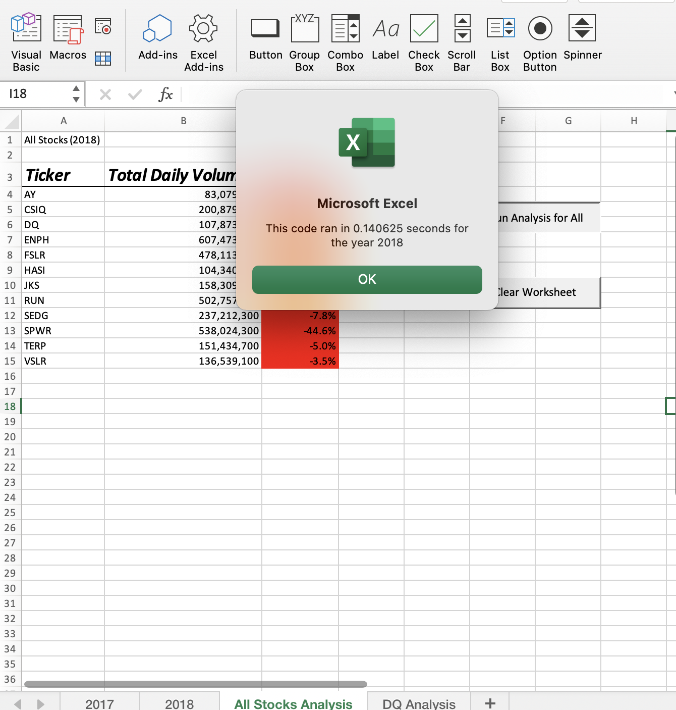
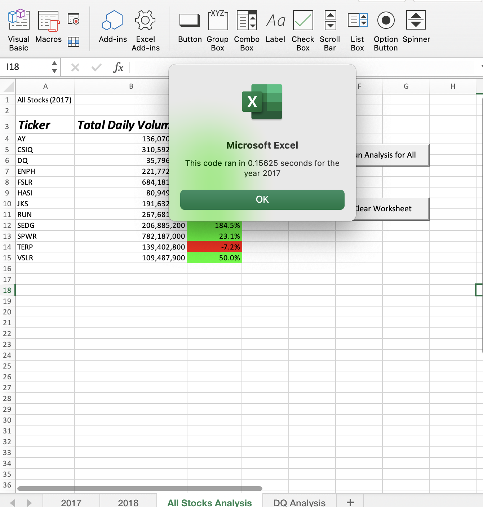

# Stock Analysis

## Overview

Refractored and excitisng VBA module to loop throuhgh data faster than originially performed. The original module worked but it was slower when returning the results. 

## Results 

The refractored module retuned results much faster than the original VBA code. When I fist ran the code for 2018 I got and answer in 1.09375 seconds and for 2017 in 1.039062 seconds. The original piece of code had to loop through the data multiple times causing it to be slightly slower than the refractored code and if the data had been more significant it would be a bigger difference. Once the code was refractored I was able to loop through the data just once and the return responce was signifincanlty faster. 
In the orignal worksheet you can see how much slower the responce is.

 

In the above example we can see how much faster the ran through the refractored code for 2018 and 2017. For 2017 the refractored code ran in 0.15625 seconds versus 1.039062 second on the original code, 2017 ran 85% faster with the refractored code. 2018 was 1.09375 versus 0.140625 and that is an 87% in crrease in response time. 

## Summary

